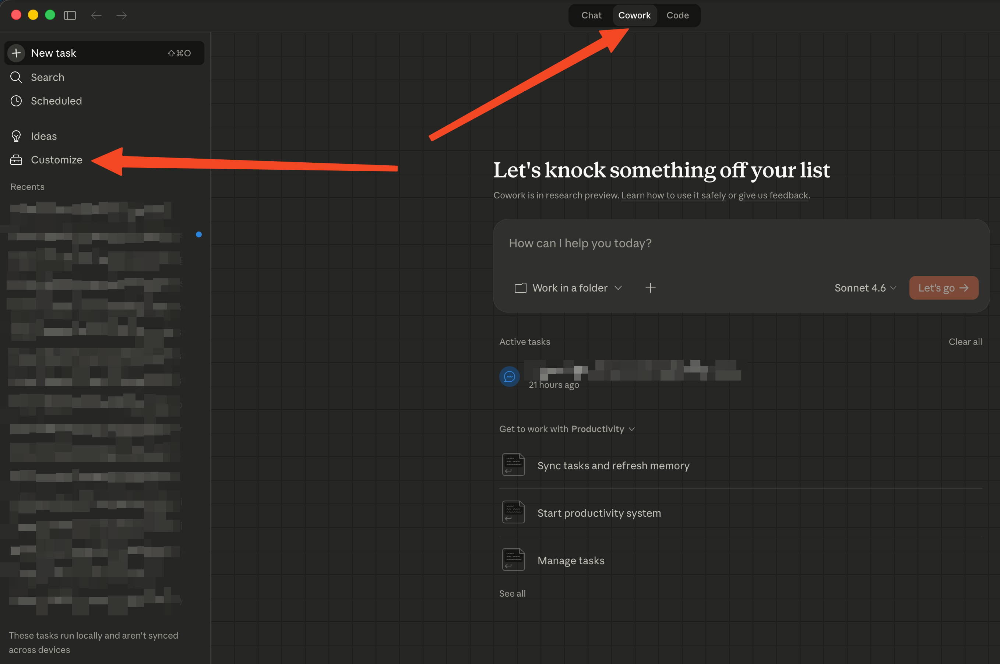
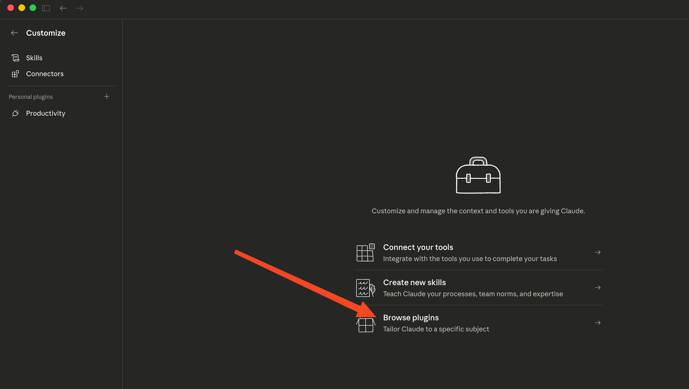
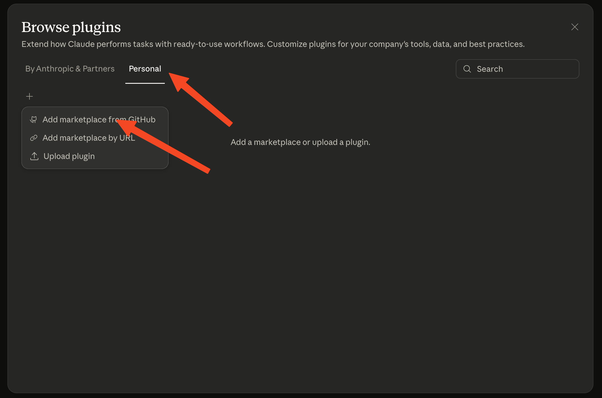
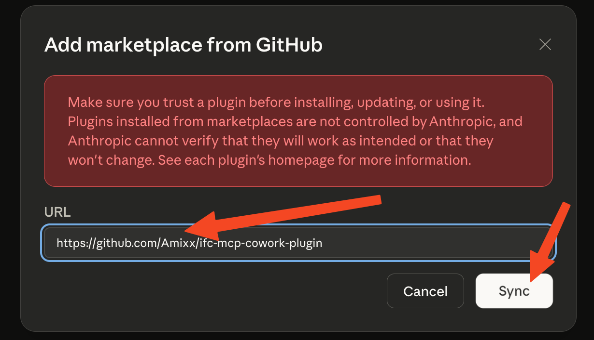
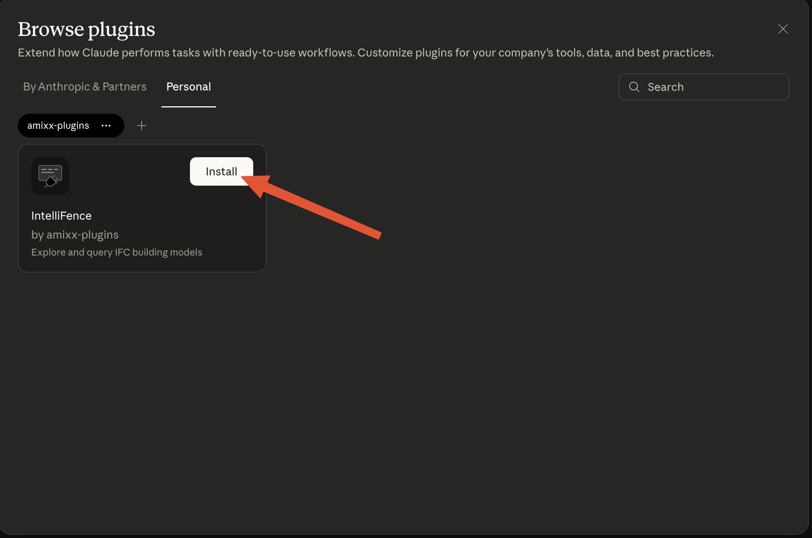
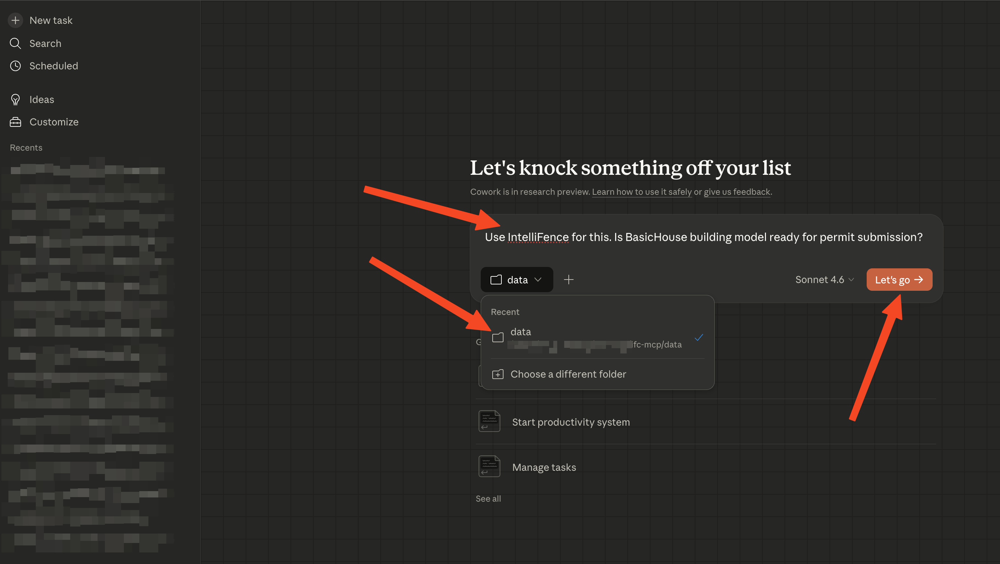

# Add IntelliFence to Cowork from the UI

## Step 1: Open Customize → Browse plugins

## Step 2: Personal tab → Add marketplace from GitHub

## Step 3: Paste the repository URL and sync

Paste the IntelliFence repository URL (`https://github.com/Amixx/ifc-mcp-cowork-plugin`) and click `Sync`.

## Step 4: Install IntelliFence

## Step 5: Start a new session

Start a new Cowork session, connect a folder with IFC files, and you're good to go!

